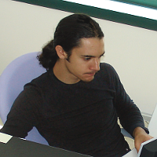

# [Curriculum Vitae](http://labs.easyblog.it/stefano-cudini/)

  1. Settore professionale
  2. Competenze tecniche
  3. Progetti personali
  4. Esperienze professionali
  5. Altre esperienze professionali
  6. Esperienze non professionali
  7. Istruzione e formazione
  8. Interessi personali

* * *

## Informazioni personali

Nome e Cognome

## [Stefano Cudini](https://plus.google.com/u/0/+StefanoCudini?rel=author)

Residenza

[Narni (TR)](http://osm.org/go/xdC9Ypg1-)

E-mail

[stefano.cudini@gmail.com](mailto:stefano.cudini@gmail.com)

Sito web

[labs.easyblog.it](http://labs.easyblog.it)

Social networks

[github.com/stefanocudini](http://github.com/stefanocudini)  
[osm.org/user/StefanoCudini](http://www.openstreetmap.org/user/StefanoCudini)  
[stackoverflow.com/users/526444s](http://stackoverflow.com/users/526444/stefan
ocudini)  

Cittadinanza

Italiana

Data di nascita

4 aprile 1982

Sesso

Maschile

Patente di guida

Tipo B, Automunito

* * *

## Settore professionale

  * Programmatore **PHP** e **Javascript**
  * Analista/Programmatore **sistemi GIS** e **Web Mapping**
  * Amministratore **server GNU/Linux**
  * **Frontend Developer**

* * *

## Competenze tecniche

  * _Linguaggi:_ **PHP**, **Javascript**(client e server), Python, Bash scripting, C, Java
  * _Librerie e framework:_ **jQuery**, **NodeJs**, **MeteorJs**, Bootstrap, **Leaflet**, **Openlayers**, ExtJs, **RequireJS**, AmplifyJs
  * _Linguaggi di Markup: _ XHTML, **HTML5**, **CSS3**, XML, RSS
  * _Database:_ MySQL, **MongoDB**, Postgresql/**Postgis**, Sqlite
  * _Daemons:_ **Apache**, Lighttpd, **Nginx**, Proftpd, Postfix, Dovecot, Fail2Ban
  * _Sistemi Operativi:_ Ottime conoscenze di **Debian** GNU/Linux **Server**, Ubuntu Desktop, Windows XP 
  * _Sistemi di versioning:_ **Mercurial**, Git
  * _Software particolari:_ **Qgis**, **Josm**, AutoCAD, **[CorelDraw**](http://easyblog.it/corso-coreldraw/), Inkscape, Gimp, VirtualBox
  * _Cms e piattaforme web:_ **Wordpress**, Drupal, OsCommerce
  * _Tools di sviluppo:_ Sublime Text, Nano, Gedit, **GruntJS**, NPM, Bower, Firebug, Chrome console

* * *

## Progetti personali

#### [Mixtags.com](http://mixtags.com/)

Servizio avanzato di **bookmarking** con **folksonomy**.

#### [Ultra Light Gallery](http://easyblog.it/photos/demo/)

**Photo Gallery** Wysiwyg in **PHP**/**jQuery** con **struttura modulare**.  
Oltre 30 plugins, ottimizzazioni SEO, **upload Ajax**, **compressione
Javascript** automatica.

#### [Tracks Optimizer online](http://localhost/maps/gpx-simplify-optimizer/)

Web app per **ottimizzare tracce** GPX/KML/GeoJSON online, con **algoritmo [RD
P](http://en.wikipedia.org/wiki/Ramer%E2%80%93Douglas%E2%80%93Peucker_algorith
m)**.

#### [Track GPS Network](http://labs.easyblog.it/maps/gps-network-tracking-
system/)

Sistema di **tracking realtime**, archiviazione in **Postgis**, front-end in
**Openlayers**.

#### [Leaflet Control Search](http://labs.easyblog.it/maps/leaflet-search/)

Popolare **plugin Leaflet** per la ricerca di elementi all'interno di un layer
e tramite **Jsonp/Ajax**.

#### [Leaflet Panel Layers](http://labs.easyblog.it/maps/leaflet-panel-
layers/)

**Plugin Leaflet** estensione di Control.Layers per gestire **gruppi multipli di layers** e **legenda** con icone. 

#### [DNS-320 PHP Interface](http://labs.easyblog.it/dns-320-command-line/)

**Interfaccia a riga di comando** del NAS Dlink ShareCenter Pulse. 

#### [Share Gpx Tracks](http://labs.easyblog.it/maps/share-tracks/)

Condivisione ed **embedding di tracce gpx**

#### [labs.easyblog.it](http://labs.easyblog.it/)

Demo di **applicazioni web** varie

#### [labs.easyblog.it/web-mapping](http://labs.easyblog.it/web-mapping/)

Demo **applicazioni GIS** e **Web Mapping**

* * *

## Esperienza professionale

Date

Agosto 2013 - Gennaio 2014

Lavoro o posizione ricoperti

  * Amministratore di sistema, programmatore PHP/Javascript sul **Sistema di Telemetria**:  
[Agrisystema.com](http://agrisystema.com/)

  * Configurazione/**amministrazione server** della piattaforma, con **OS Debian GNU/Linux**
  * Progettazione e implementazione del sistema di acquisizione dati (daemon **NodeJS**):  
[GPS Data Server](http://labs.easyblog.it/gpsdata_server/#architecture)

  * Implementazione dell'interfaccia di back-end per il **monitoring real-time** del **GPS Data Server**:  
[Monitoring](http://labs.easyblog.it/gpsdata_server/#backend)

  * Riprogettazione del layout e integrazione con **jQuery UI**:  
[Front-end](http://labs.easyblog.it/gpsdata_server/#frontend)

  * Ottimizzazioni varie nella gestione dei grafici

Nome e indirizzo del datore di lavoro

Agri ART s.r.l.  
Voc. Pischiello 20, Passignano sul Trasimeno, Perugia  
www.artagri.it

* * *

## Esperienza professionale

Date

Settembre 2012 - Gennaio 2013

Lavoro o posizione ricoperti

  * **Programmatore Javascript** per il progetto **Mapstore**:  
[mapstore.geo-solutions.it](http://mapstore.geo-solutions.it/)  
[github.com/geosolutions-it/mapstore](https://github.com/geosolutions-
it/mapstore/commits?author=stefanocudini)

  * Customizzazione **front-end** di [GeoExplorer](http://suite.opengeo.org/opengeo-docs/geoexplorer/) con libreria **GeoExt**
  * Integrazione della visualizzazione dati con Google Earth
  * Bugfix posizionamento **markers**
  * Bugfix **printing window**
  * Integrazione con sistemi di **social sharing**
  * I18n dell'interfaccia utente
  * Integrazione con Google URL Shortener
  * Gestione rimozine nel Manager Utenti

Nome e indirizzo del datore di lavoro

GeoSolutions s.a.s.  
Via Poggio alle Viti 1187, Massarosa, Lucca  
www.geo-solutions.it

* * *

## Esperienza professionale

Date

Dicembre 2011 - Febbraio 2012

Lavoro o posizione ricoperti

  * Programmatore PHP e consulente, per il sito di gambling: www.winonsky.com   
  
[Video Demo](http://www.youtube.com/watch?v=_6xUjevLpXs)

  * Configurazione per supporto alle specifiche [DKIM](http://www.dkim.org/) e [SPF](http://it.wikipedia.org/wiki/Sender_Policy_Framework)
  * Integrazione nell'applicazione del [gateway di pagamento Paypal](https://developer.paypal.com/)
  * Programmazione javascript interfaccia

Nome e indirizzo del datore di lavoro

Webel Soluzioni informatiche  
Via valle cupa 8, Viterbo  
www.webel.it

* * *

## Esperienza professionale

Date

Febbraio 2010 - Luglio 2010

Lavoro o posizione ricoperti

  * Programmatore PHP/MySQL/Javascript, Webdesigner
  * Progettazione e sviluppo di **interfacce interattive**(basate su jQuery/Ajax)  
per la presentazione delle ricerche statistiche su dati regionali Istat  

  * Progettazione dell'archiviazione e catalogazione dati su ** database MySql**. 
  * Bilanci Comunali per le regioni Toscana, Lombardia e Piemonte:  
[Bilanci_Toscana](http://labs.easyblog.it/portfolio/ires/Bilanci_Toscana/)  

  * Dati Socio Demografici per le regioni Lombardia e Piemonte:  
[Dati demografici](http://labs.easyblog.it/portfolio/ires/Bilanci_Lomb_2010_X/
dati_demografici/)

  * Banca dati Convenzioni per Auser Filo d'Argento([www.auser.it](http://www.auser.it)):  
[Auser
Convenzioni](http://labs.easyblog.it/portfolio/ires/Auser_Convenzioni_2010/)

  * Design del layout del portale:  
[Homepage portale](http://labs.easyblog.it/portfolio/ires/homepage3/)

Nome e indirizzo del datore di lavoro

Associazione IRES Lucia Morosini  
Via Carlo Pedrotti 5, Torino  
www.iresluciamorosini.it

* * *

## Esperienza professionale

Date

Febbraio 2008 - Maggio 2008

Lavoro o posizione ricoperti

  * Programmatore PHP, Web designer, per il portale di cinema:  
[www.movieplayer.it](http://www.movieplayer.it)

  * Ottimizzazione di tutto il codice html e css
  * Collaborazione programmazione in PHP su **framework MVC** Codeigniter

Nome e indirizzo del datore di lavoro

NetAddiction s.r.l.  
Via Archiemede 19, Terni  
www.movieplayer.it

* * *

## Esperienza professionale

Date

Dicembre 2007 - Aprile 2008

Lavoro o posizione ricoperti

  * Programmatore PHP, Javascript
  * Riprogettazione del **cms aziendale** con struttura modulare:  
www.operagrafica.it

  * Sviluppo del cms aziendale con struttura modulare

Nome e indirizzo del datore di lavoro

E-volving, business integration  
Via del Maglio 6, Terni  
www.e-volving.it  

* * *

## Esperienza professionale

Date

Aprile 2006 - Febbraio 2007

Lavoro o posizione ricoperti

  * **Programmatore PHP/MySQL** del portale e di siti minori:   
[www.multiplayer.it](http://www.multiplayer.it)

  * Ottimizzazione e ottimizzazione del codice php nelle piu importanti sezioni del portale
  * Amministrazione e configurazione della LAN interna alla sede dell'azienda, condivisioni/utenti/stampanti/backups.
  * **Ottimizzazione SEO** e inidicizzazione specifica per il motore di ricerca google.com
  * Progettazione e programmazione di diverse sezioni backoffice del portale e del database
  * Progettazione e programmazione di soluzioni innovative per la gestione backoffice degli articoli con **Ajax**, **jQuery**
  * Creazione completa di alcune nuove parti del portale, tra cui un motore di ricerca interno per gli utenti registrati
  * Programmazione di **Web Services**(SOAP) per la comunicazione con server di terze parti(H3G e TRE)
  * Installazione del gestionale aziendale([Gestionaleopen](http://www.gestionaleopen.org/)), su piattaforma virtualizzata in abiente [XEN](http://www.xenproject.org/)
  * Programmazione engine dei Feed RSS, categorizzazione e binding con i database del portale
  * Integrazione di diverse parti del portale con le **librerie php SMARTY** ed **AdoDB**
  * Realizzione di un server con controllo centralizzato per la visione di filmati su schermi interni all'azienda.
  * Collaborazione all'installazione e cablaggio di parte dell'hardware presente nella webfarm, installazione server di **OS Debian GNU/Linux**

Nome e indirizzo del datore di lavoro

NetAddiction s.r.l.  
Via Archiemede, 19 Terni  
www.multiplayer.it  
www.multiplayer.com

* * *

## Altre esperienze professionali

**Ungiro.it** piattaforma di condivisione percorsi cicloturistici:  
[www.ungiro.it](http://www.ungiro.it/)  
  

  * Programmazione Javascript [sistema di Web Mapping](http://goo.gl/pO9yVt) con **LeafletJS**
  * Condivisione di **tracciati GPX**
  * Ricerca di luoghi su sorgente dati [OpenStreetMap](http://osm.org/)
  * Ottimizzazione per la **gestione dei POI** (Place Of Interest)

**Abramomax** Immobiliare:  
[www.abramomax.it](http://www.societaimmobiliari.net/abramomax-spa-orbetello/)  
  

  * Webdesigner, Grafico
  * Creazione del **layout** del portale:  
[portfolio/abramomax.it/](http://labs.easyblog.it/portfolio/abramomax.it/)

  * Grafica del logo aziendale:  
[portfolio/abramomax.it/logo](http://labs.easyblog.it/portfolio/abramomax.it/_
logo/loghi_proto.jpg)

**Altri siti** web realizzati:   
  

  * [Stefanorossini.it](http://stefanorossini.it)
  * [Ryuzan.it](http://ryuzan.it)

* * *

## Esperienze non professionali

Date

Ottobre 2013

Lavoro o posizione ricoperti

Ammappalitalia, Percorsi e tracciati da paese a paese:
[www.ammappalitalia.it](http://www.ammappalitalia.it/)  
  

  * Programmazione Javascript e PHP
  * Implementazione del sistema di **web mapping** utilizzato per la visualizzazione dei percorsi
  * Sistema di pubblicazione **real time** di percorsi associati ad eventi con tecnologie **html5**

Date

Settembre 2005

Lavoro o posizione ricoperti

La Siviera Officina Sociale:
[www.lasiviera.cesvol.net](http://www.lasiviera.cesvol.net/)  
  

  * Vincitore del bando di concorso per la realizzazione del **portale web** [CESVOL](http://www.cesvol.net/)
  * Progettazione, sviluppo del **cms** e realizzazione completa della grafica
  * Programmazione del **backoffice** per la pubblicazione di articoli/appuntamenti/eventi
  * Creazione di un engine per la gestione di news nazionali basato su **feed RSS**

Date

Marzo 2003

Lavoro o posizione ricoperti

Webdesign in Flash del portale della Facolta' di Ingegneria Informatica sede
di Orvieto:  
[Uniorvieto](http://labs.easyblog.it/portfolio/uniorvieto)

Date

Anni 2001-2002

Lavoro o posizione ricoperti

Gruppo Speleologico UTEC Narni:
[www.spelex.net/utec](http://labs.easyblog.it/portfolio/utec)  
  

  * Prima esperienza di programmazione PHP/MySQL
  * webmaster

Date

1998

Primo sito web personale  

  * [www.spelex.cjb.net](http://spazioinwind.libero.it/spelex/)

* * *

## Istruzione e formazione

Date

Luglio 2001

Titolo della qualifica rilasciata

Diploma di Maturita' conseguito all' Istituto Tecnico  
Insustriale Statale L.Allievi di Terni, in "Perito Industriale Capotecnico  
Elettrotecnico: specializzato in Automazione"  

Date

Settembre 2001

Iscritto all'universita'  degli studi di Perugia nel Corso  
di Laurea in Ingegneria Informatica e delle Telecomunicazioni, sede di
Orvieto.  
Conseguiti tutti gli esami riguardo programmazione e reti

## Lingue

Madrelingua

Italiano

Altre lingue

inglese (ottima comprensione scritto/letto)

* * *

## Associazioni

Date

Anno 2006

Posizione ricoperta

Membro Fondatore del **GNU Linux User Group** di Terni.  

Date

Anno 2007

Posizione ricoperta

  * Portavoce associazione TerniLUG nel CCOS
  * Membro del consiglio esecutivo del **CCOS** (Centro di Competenza Regionale sull'OpenSource)

Date

Anno 2008

Posizione ricoperta

Membro fondatore della Federazione Umbra Gruppi Speleologici.

Date

Anni 2004-2006

Posizione ricoperta

Tecnico volontario del Corpo Nazionale Soccorso Alpino.

* * *

## Interessi personali

  * Fotografia:  
[easyblog.it/photos/stefano](http://easyblog.it/photos/stefano)  

  * Sport praticati:  
Arrampicata Sportiva, Canyoning, Speleologia, Alpinismo, DownHill, Parapendio.

Libri, Manuali, Articoli

  * [Libri in biblioteca](http://easyblog.it/photos/stefano/libri/)
  * [Anobii.com](http://www.anobii.com/stefanocudini/books), [Scribd.com](http://www.scribd.com/zakis_)
  * Autore di vari articoli su CorelDRAW:  
[Corso di introduzione a CorelDRAW](http://easyblog.it/corso-coreldraw/)

AI senti della legge 196/03 e successive modifiche autorizzo il trattamento
dei miei dati personali contenuti in questo curriculum

[[Valid XHTML]](http://validator.w3.org/check?uri=referer) • [[Valid
CSS]](http://jigsaw.w3.org/css-validator/check/referer)

Indice

